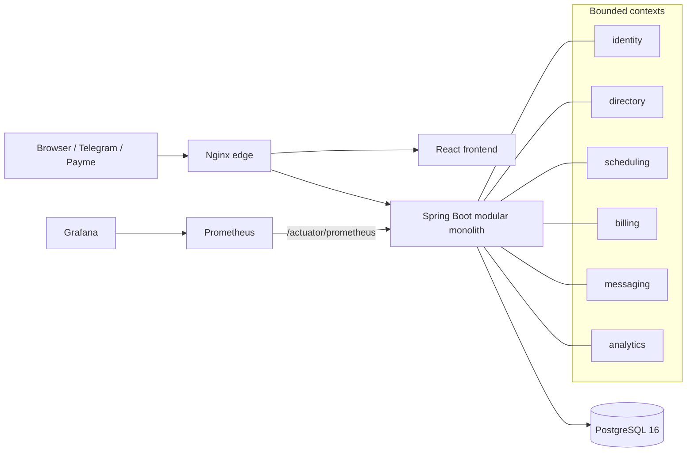

# CRMIX architecture

## Boundaries

`identity` owns tenants, users, authentication and subscription identity. `directory` owns clients, employees and services. `scheduling` owns appointments and emits application events. `messaging` reacts to scheduling events and owns reminder delivery. `billing` owns subscription and appointment payment facts. `analytics` is read-only and aggregates tenant-scoped operational data.

Cross-module business coupling is kept one-way. Scheduling does not call messaging. Billing stores appointment IDs as references but database composite foreign keys enforce same-tenant integrity without importing scheduling repositories.

## Tenant isolation

Every tenant-owned table carries `tenant_id`. Request authentication resolves tenant from the JWT claim. Transactions set PostgreSQL `app.tenant_id`; restrictive RLS policies plus `FORCE ROW LEVEL SECURITY` ensure an accidental query without a tenant predicate still cannot read another tenant. Runtime DB credentials are intentionally non-superuser.

## Concurrency

Appointment creation performs an explicit overlap pre-check for a useful 409 response. PostgreSQL remains the final arbiter through a GiST exclusion constraint, so concurrent requests cannot create overlapping active appointments.

## Payment consistency

Subscription payment intents require `Idempotency-Key`. Payme provider transaction IDs are persisted and repeated JSON-RPC calls return stable state. Appointment payments are separate business-revenue facts and are protected by `(tenant_id, appointment_id)` referential integrity.

## Operational boundaries

Postgres and backend are not published as public host ports. Nginx is the edge. Prometheus scrapes backend over the Compose network. Grafana defaults to localhost binding. Backups are only considered successful after an off-server S3-compatible upload.
